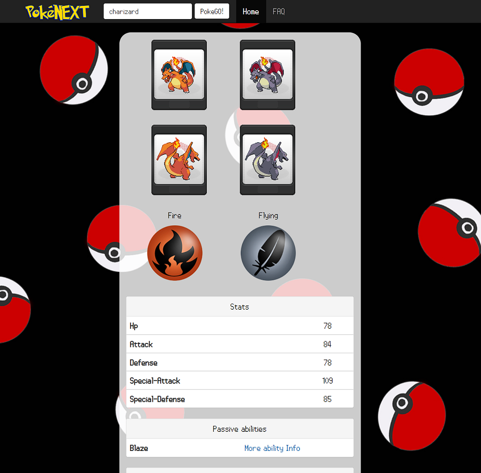

# pokenext

Back in February 2018, hacked a "Pokédex" clone in less than 12 hours, working together with @rmontanodev
It was part of a small exercise to learn about API requests, and displaying them in a beautiful, simple frontend.

Features:
- Pokemon search using PokeAPI
- Displays front/back/shiny sprites, and pokemon type
- Lists Stats, Passive Abilities and Moves
- Original logo, fonts and backgrounds from the original game.
- Can use the original .gif sprites of the game, the code is commented out, since we use the sprites in the PokeAPI by default, but you can use your own sprites if you update the `pokemones.js` and `main.js` files.





## Installation

Frontend dependencies are included, backend uses PHP & Apache2 webserver.
Find here how to install the [LAMP stack on Ubuntu 22.04](https://www.digitalocean.com/community/tutorials/how-to-install-linux-apache-mysql-php-lamp-stack-on-ubuntu-22-04).


## Usage

Run `./deploy.sh`, which will copy the contents of pokenext-web to the default apache2 folder, and then restart apache2 service.

```
sudo rm -rf /var/www/html/*
sudo rsync -vpr ./pokenext-web/. /var/www/html/.

sudo service apache2 restart
sudo service apache2 status
```

## License

[MIT](https://choosealicense.com/licenses/mit/)